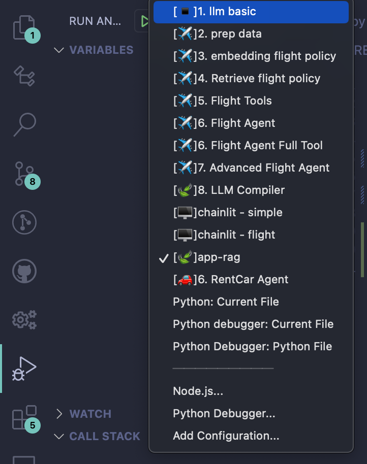

# multi-agent-playground

## 1. Requirements
- python >= 3.10
## 2. Install
```Bash
pip install requirements.txt
```
## 3. Create Env File
```Bash
cp .env-example .env
```
- modify .env file
## 2. Run
- Open Visual Studio Code
- Open `Run and Debug` Menu
- Click From the Beginning

  - [▪️]1. llm basic : 간단 llm 호출
  - [✈️]2. prep data  : 항공사 고객센터 데이터 생성
  - [✈️]3. embedding flight policy : Vector Store에 데이터 indexing
  - [✈️]4. Retrieve flight policy: 검색
  - [✈️]5. Flight Tools : Function call 실습
  - [✈️]6. Flight Agent : ReACT Agent 실습
  - [✈️]7. Advanced Flight Agent: LangGraph로 Tool실행 Agent 실습
  - [🍃]8. LLM Compiler
  - [🖥]chainlit - simple : 간단 챗봇 UI 화면 
  - [🖥]chainlit - flight: 고객센터 챗봇 UI 화면
  - [🍃]app-rag : langserve로 api 서버 만들기
